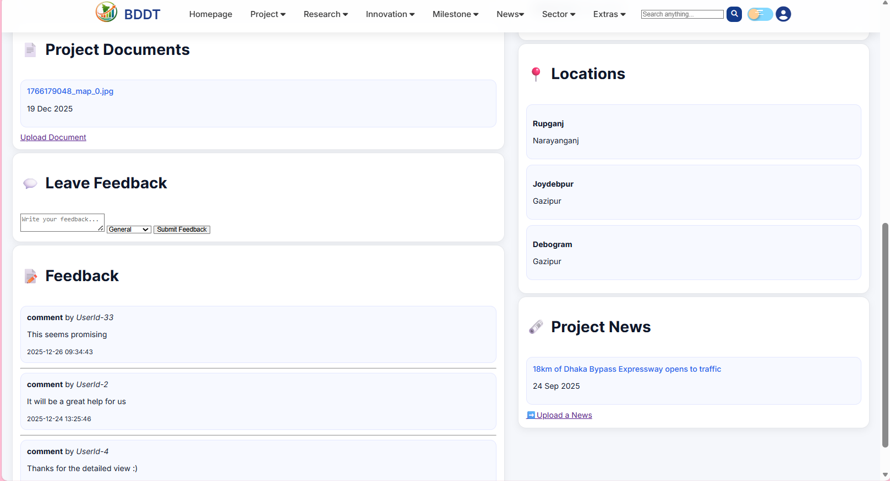
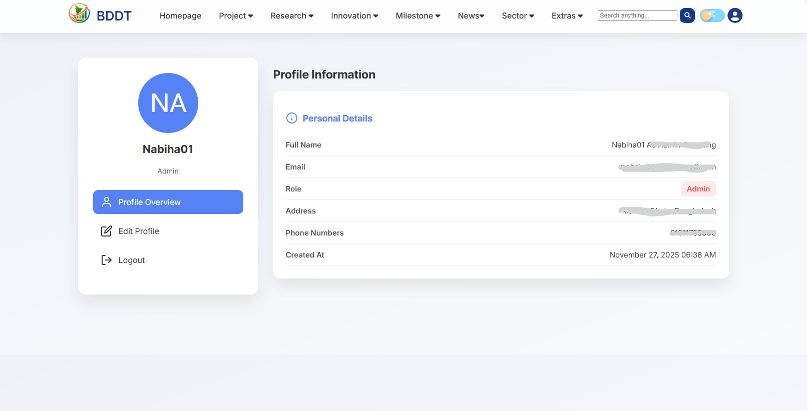

# BDDT

**Webside** - https://bddt.infinityfree.me/

## 📌 Project Overview

**BDDT** is a project developed as part of the **311 Government Project**. The system is designed and implemented independently, focusing on practical problem‑solving, clean architecture, and real‑world applicability. The goal of BDDT is to demonstrate structured development practices, logical workflow design, and proper documentation suitable for academic and professional evaluation.

## 🎯 Objectives

* Design and implement a functional system from scratch
* Apply structured logic and modular development practices
* Ensure maintainable and readable code
* Follow ethical and academic integrity standards

## 🛠️ Technologies Used

* **Language:** PHP / JavaScript
* **Frontend:** HTML, CSS, JavaScript
* **Backend:** PHP 
* **Database:** MySQL
* **Tools:** Git, GitHub, Browser APIs

## ⚙️ Features

* Public access to government **Projects, Innovations, Researches, and Milestones**
* Clear categorization by status:

  * **Ongoing**
  * **Active**
  * **Completed**
  * **Cancelled**
* Detailed project pages with descriptions, timelines, and related resources
* Feedback system allowing users to share opinions and suggestions
* Document upload feature with verification workflow

## 👥 User Roles & Permissions

### 👤 General Users (Public)

* View all publicly available projects, innovations, researches, and milestones
* Filter content by category and current status (ongoing, active, completed, cancelled)
* Submit **feedback** on projects and initiatives
* Upload **supporting documents** related to projects
* Uploaded documents remain in **pending status** until verified by an administrator

### 🧑‍💼 Government Employees

* Add new **projects, innovations, researches, and milestones**
* Upload official **documents** and **news updates**
* Submit feedback related to initiatives
* Track progress and status updates of their submitted content

### 🛡️ Administrators

* Full control over all system data
* **Verify, approve, or reject** uploaded documents
* **Create, update, and delete** projects, innovations, researches, milestones, news, feedbacks, and documents
* Ensure content accuracy, authenticity, and compliance with government standards

## 🔄 System Workflow Diagram (Textual Representation)

```
Public User
   │
   │ View Projects / Innovations / Researches / Milestones
   │ Filter by Status (Ongoing | Active | Completed | Cancelled)
   │
   ├──► Submit Feedback ───────────────┐
   │                                   │
   └──► Upload Documents (Pending) ────┤
                                       ▼
                              Administrator Review
                               │        │
                               │        ├── Verify / Approve
                               │        └── Reject / Delete
                               ▼
                        Verified Content Published

Government Employee
   │
   ├── Add Projects / Innovations / Researches / Milestones
   ├── Upload Documents & News
   └── Update Status and Progress

Administrator
   │
   ├── Manage All Content (CRUD)
   ├── Verify Documents
   ├── Approve / Reject Submissions
   └── Maintain System Integrity
```

## 📂 Project Structure

```
BDDT/
├── profile files/                # Source code
├── database/           # SQL files 
├── docs/               # Documentation
├── README.md           # Project documentation
```

## 🚀 How to Run the Project

1. Clone the repository:

   ```bash
   git clone https://github.com/nabiha02/BDDT.git
   ```
2. Open the project directory
3. Configure database settings (if required)
4. Run the project using a local server or appropriate runtime

## 📜 License

This project is licensed under the **MIT License**. You are free to use, modify, and distribute this software with proper attribution.

## 👤 Author

**Chaiti**
Developed independently for the 311 Government Project

## 🖼️ Project Screenshots

Below are representative screenshots of the major system modules to help understand the workflow and user experience. These images demonstrate both public-facing and role-based dashboards.

### 🔐 Login / Signup Transition (UI Animation)
▶️ Short demo showing the smooth sliding transition between login and signup screens.

https://github.com/user-attachments/assets/7084eb3f-baea-4c39-af9f-b82d18b774a7


### 🏠 Index / Home Page

* Displays featured projects, innovations, researches, and milestones
* Highlights different **sectors** and current project statuses

https://github.com/user-attachments/assets/8591b09d-298e-4ac3-9c43-8b9e6c458c22


### 📋 Project Listing & View Page

* Detailed view of individual projects
* Shows description, sector, timeline, and status (Ongoing / Active / Completed / Cancelled)





### 📰 News & Announcements

* Separate section for official news and updates
* Managed by government employees and admins

```

```

### 🏢 Sector-wise Categorization

* Projects organized by different government sectors
* Improves accessibility and discoverability

```

```

### 👤 User Profile

* Displays user information and activity
* Shows submitted feedback and uploaded documents

```

```


### 📊 Dashboard (Role-Based)

* Government employee dashboard for managing content
* Admin dashboard for verification and system control

```

```

### ➕ Add Projects & Upload Documents

* Forms for adding new projects, innovations, researches, and milestones
* Document upload with **pending verification** status

```


```

---

## 🎓 Academic Information

* **Faculty:** NLH
* **Instructor:** Tushar Basak

## 📌 Notes

* This project was created for educational and demonstration purposes
* Designed following government-level workflow and verification standards
* Screenshots are illustrative of the system’s major functionalities

---
